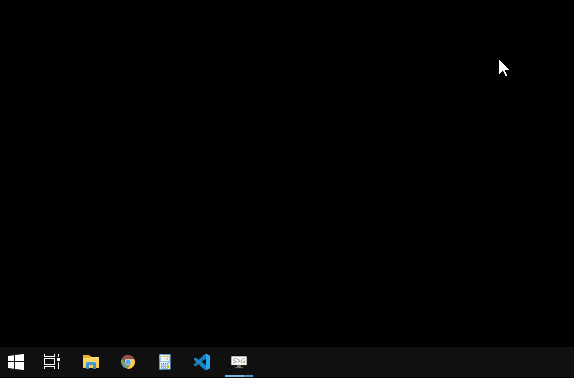
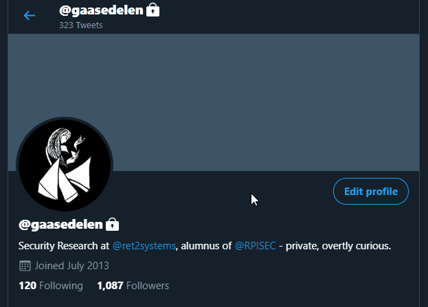

# Keyhole - Universal Keyboard Navigation

## Overview

Keyhole is an *assistive and productivity-based* software technology that facilitates universal keyboard navigation of GUI-based systems. This project employs [computer vision](https://opencv.org/) to generically identify & label on-screen 'click targets' for ace-jump style interaction. Consumer grade [eye tracking](https://gaming.tobii.com/product/tobii-eye-tracker-4c/) technology is used to further augment its efficiency & reduce user keystrokes.

This software is labeled only as a prototype & code resource for the community. Please note that this project is *extremely experimental* and is currently not in a great state for general consumption.

## Releases

* v0.1 -- Initial release

# Installation

Keyhole requires the unique Windows entitlement of `UiAccess`, and therfore must be installed to a *trusted* directory:

* `C:\Program Files\`
* `C:\Windows\system32\`

The 'sample' [binary release](https://github.com/gaasedelen/keyhole/releases) is self-signed. You must install the included certificate on your system or sign the `keyhole.exe` binary with your own certificate. Additionally, Keyhole requires you to have the [Tobii Eye Tracking Core](https://gaming.tobii.com/getstarted/?bundle=tobii-core) installed.

# Usage

While Keyhole is running, press the overlay hotkey (`F20` by default) to generate on-screen labels around your current 'gaze' on the screen. Then, simply type the letter of the label that you would like to click.

The overlay hotkey can be changed with the `-k` key on the command line.

# Future Work

Time and motivation permitting, future work may include:

* Mouse Actions
  * ~~Left Click~~
  * Right Click (via click and hold)
  * Double Click
  * Click & Drag (kinda hard)
* Improve 'hard' test cases where too many click targets exist
* Simple Animations
  * Brief green flash of good target click, hide others immediately
  * Brief red flash of all targets if bad key clicked
  * Screenwide (?) error flash when eye/gaze data not available?
* Port the non-eyetracking / treemap based prototype to C#
* Multi-monitor support? (not a priority for the author ...)

I welcome external contributions, issues, and feature requests.

# Authors

* Markus Gaasedelen ([@gaasedelen](https://twitter.com/gaasedelen))
